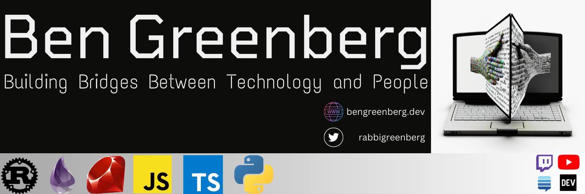

# 

### 

 

  
  

<table border="0">
<tr>
<td width="50%">
<h3>It's so nice of you stop by! ☺️</h3>

I work as a Lead Developer Relations Engineer 🥑 at [New Relic](https://www.newrelic.com/) where I manage a team of developer advocates, and drive forward adoption of observability in the developer community.

In my personal life, you can find me involved in some of these projects:

* I am building [hirethePIVOT](https://hirethepivot.com), an open source reverse job board for career changers. 
* Co-founded and co-organize the [israel.rb](https://www.facebook.com/groups/272757750683415) meetup community.
* Published the [Torah && Tech](https://torahandtech.dev) weekly newsletter and book.

Some recent talks I've given at conferences include:

* [On Being An Early Career Dev In Your 30s](https://youtu.be/_YhBMu43Lm4) at RubyConf
* [Create Tooling That Works for Everyone with GitHub Actions](https://youtu.be/rSpvVL4RxH8) at DevOpsDays Buffalo
* [Transforming a Docs Portal into a Platform Tool](http://mirroronet.pl/pub/mirrors/video.fosdem.org/2021/D.docs/ttdstation.mp4) at FOSDEM
* [Roots for Developer Advocates](https://www.youtube.com/watch?v=o07iRbFaAy0) at DevRelCon
* [Ruby and Sentiment Analysis](https://youtu.be/lwp2A54e3fs) at NUS Hackers

I've also had a chance to chat with some great people on podcasts including:

* [The Ruby on Rails Podcast](https://fireside.fm/episode/3OC19MC9+jwYA3Iyf)
* [Kongcast](https://www.youtube.com/watch?v=5TXiFoekXb8)
* [Polyglot](https://podcasts.apple.com/us/podcast/polyglot/id1553516392)

Interested in chatting? Let's talk on [Twitter](https://twitter.com/RabbiGreenberg)!

</td>

<td style="border:0" width="20%">

  
</td>
</tr>
</table>