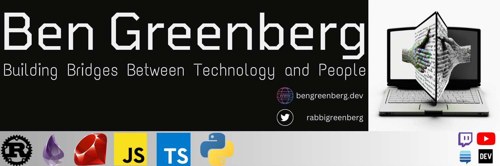

# 

 

  
  

	

<table style="border: none;">
<tr style="border: none;">
<td style="border: none;" width="50%">
<h3>It's so nice of you stop by! ☺️</h3>

I am a Developer Relations Engineer at [Arbitrum](https://www.arbitrum.foundation/) and a Principal Consultant at [Yalla, DevRel LLC](https://wwww.yalladevrel.com). My work bridges the divide between developer-focused companies and the developers who build with them. I have worked in lead roles in DevRel teams in companies such as Vonage, Orbit, New Relic, and Parity Technologies.

In my personal life, you can find me involved in some of these projects:

* Author of [Vector Search with JavaScript](https://pragprog.com/titles/bgvector/vector-search-with-javascript/) published by Pragmatic Bookshelf.
* As a member of the board of [Ruby Central](https://rubycentral.org/), helping to support the Ruby community.
* I am building [sponsorsearchAI](https://sponsorsearchAI.com), a resource to help companies find the right developer events to sponsor. 
* Co-founded and co-organized the [israel.rb](https://www.facebook.com/groups/272757750683415) meetup community.
* Published the [Torah && Tech](https://torahandtech.dev) weekly newsletter and book.

Some recent talks I've given at conferences include:

* [Vector Search for Decentralized Systems](https://ethcc.io) at ETHCC
* [Mastering Reactive Patterns with Node.js](https://www.nodetlv.com/events/eventful-databases-mastering-reactive-patterns-with-node-js) at NodeTLV
* [Smart Contracts without the Handcuffs](https://www.ethdam.com) at ETHDam
* [Build Distributed Architecture with wasmCloud](https://2025.wasm.io/sessions/building-a-distributed-architecture-with-wasmcloud-hands-on-workshop/) at WASM I/O
* [Vector Search for Decentralized Systems](https://www.youtube.com/watch?v=3eE6FruEJgs) at ETHDenver

I've also had a chance to chat with some great people on podcasts, including:

* [The Ruby on Rails Podcast](https://fireside.fm/episode/3OC19MC9+jwYA3Iyf)
* [Kongcast](https://www.youtube.com/watch?v=5TXiFoekXb8)
* [Polyglot](https://podcasts.apple.com/us/podcast/polyglot/id1553516392)

Interested in chatting? Let's talk on [Twitter](https://twitter.com/hummusonrails)!

</td>

<td style="border: none;" width="40%">

  

	
### Recent Open Source Projects

* [Mario for Developer Events](https://github.com/hummusonrails/mario)
* [Couchbase MCP Server](https://github.com/hummusonrails/couchbase-mcp-server)
* [Open Source AI Agent with Search](https://github.com/hummusonrails/browser-use-agent-with-couchbase)
* [What's for Dinner AI Assistant](https://github.com/hummusonrails/whats-for-dinner-ai-assistant)
* [Full Medium.com Clone with Rails and Couchbase](https://github.com/hummusonrails/realworld-couchbase-ruby-orm)
* [Astro Blog Integrated with Couchbase](https://github.com/hummusonrails/personal-site)
* [AI Powered Competitive Trivia with Twilio, OpenAI and Couchbase](https://github.com/hummusonrails/trivia-game)
* [Create ChatGPT App Rust CLI](https://github.com/hummusonrails/create-chatgpt-app)
* [ChatGPT Gmail Chrome Extension](https://github.com/hummusonrails/chatgpt-gmail-suggestions-chrome-extension)
* [Bayesian Probability Calculator CLI](https://github.com/hummusonrails/probability-cli)

### Recent Blog Posts

* [Cloudflare just made x402 a compliance checkbox](https://www.bengreenberg.dev/blog/cloudflare-just-made-x402-a-compliance-checkbox)
* [Your backend code is a black box. It doesn't have to be.](https://www.bengreenberg.dev/blog/your-backend-code-is-a-black-box-it-doesn-t-have-to-be)
* [You're flying blind on Claude Code spending. I built a window.](https://www.bengreenberg.dev/blog/you-re-flying-blind-on-claude-code-spending-i-built-a-window)
* [When the sirens stop, the data starts](https://www.bengreenberg.dev/blog/when-the-sirens-stop-the-data-starts)
* [AI and Stylus: The Builder's New Toolkit](https://www.bengreenberg.dev/blog/ai-and-stylus-the-builders-new-toolkit)

</td>
</tr>
</table>
